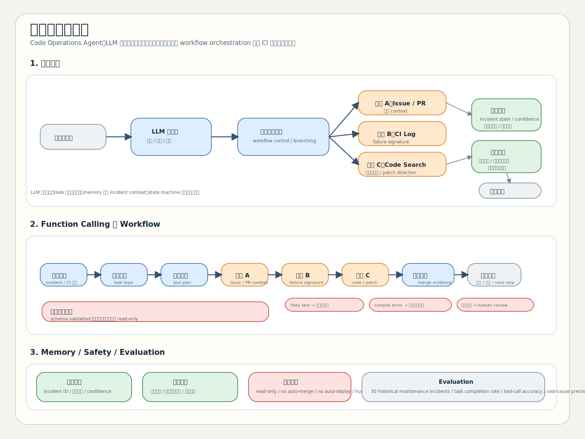

# G1-DRL-HW4-SurveyofDRLAgentAIAndSOTA

目前主要要看的內容都在 [submission](c:/Users/User/Desktop/repository/G1-DRL-HW4-SurveyofDRLAgentAIAndSOTA/submission) 資料夾。

## `submission` 裡面目前有什麼

### 1. 書面內容預覽 PDF
- [part1_part3_preview.pdf](c:/Users/User/Desktop/repository/G1-DRL-HW4-SurveyofDRLAgentAIAndSOTA/submission/part1_part3_preview.pdf)
  - 這份是第一部分與第三部分整理後的 PDF 預覽
  - 可以先用這份快速檢查報告與 `log.md` 的內容

### 2. 資訊圖
- [02_infographic.svg](c:/Users/User/Desktop/repository/G1-DRL-HW4-SurveyofDRLAgentAIAndSOTA/submission/02_infographic.svg)
  - 目前的資訊圖主版本

## 建議先看

1. [part1_part3_preview.pdf](c:/Users/User/Desktop/repository/G1-DRL-HW4-SurveyofDRLAgentAIAndSOTA/submission/part1_part3_preview.pdf)
2. [02_infographic.svg](c:/Users/User/Desktop/repository/G1-DRL-HW4-SurveyofDRLAgentAIAndSOTA/submission/02_infographic.svg)

## 資訊圖預覽

